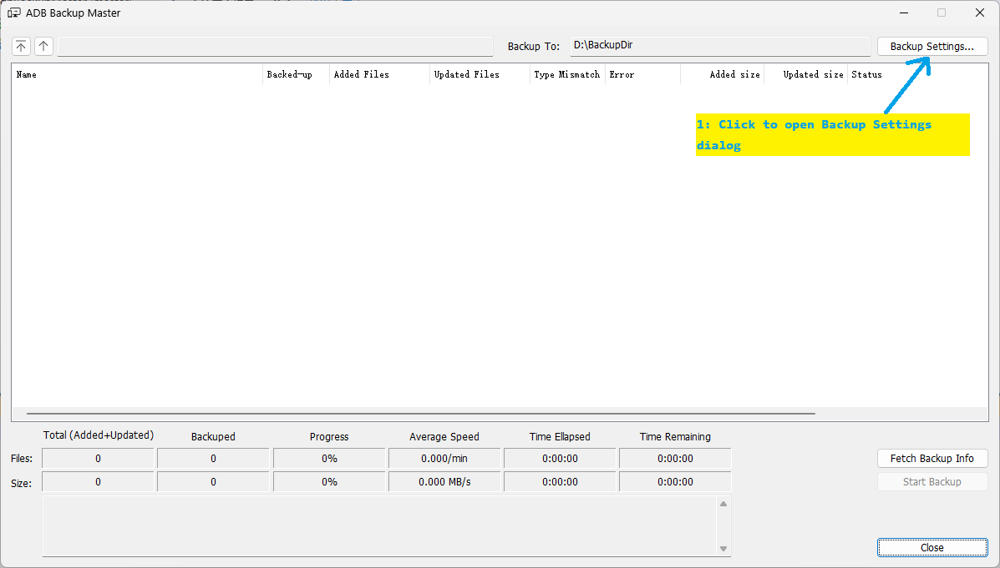
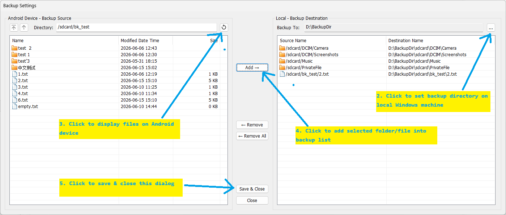
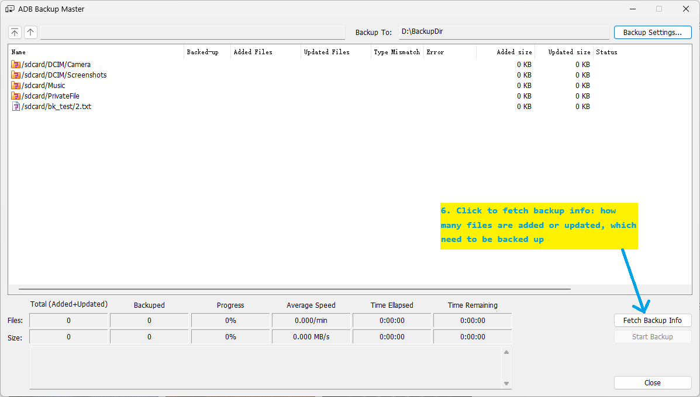
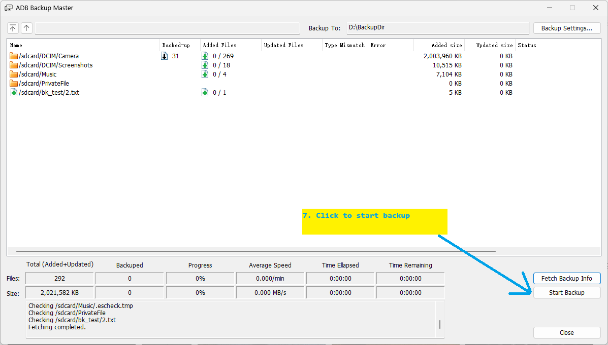

# Android Device File Backup ~~Master~~ Tool

This tool is used to back up specified folders and files from Android phone/device to a Windows computer. It fits scenarios where you need to back up specific folders and files (such as photos, music, videos, personal documents, etc.) from your Android device to your PC frequently and irregularly over a long period of time:

- **Incremental Backup**: Compare the specified folders and files on the device and the computer. Newly added or updated files will be backed up, while unchanged files will be ignored.
- **ADB Debugging Must Be Enabled on Device**: Backup relies on the official ADB tool provided by Google (included in Android SDK Platform-Tools). You need to enable ADB debugging on your device and connect it to your Windows PC via a USB cable.
- **File-Oriented Backup**: Empty folders will not be backed up.
- **No Root Access Required**: The tool can only back up files with normal permissions and cannot access files that require root or other elevated permissions.
- **Tool Operating Environment**: Windows (only tested on Windows 11)

## Compilation & Development

This tool requires Visual Studio 2022 or newer versions for compilation and development. MSVC v143 and related development tools must be installed in Visual Studio.

## Using the Tool

If you do not want to compile the source code, you can directly use the precompiled binary (`AdbBackupMaster.exe` available under the `x64/Release` directory). Copy the three files (EXE and DLLs) from the ADB folder into the `x64/Release` directory, then double-click `AdbBackupMaster.exe` to run the tool.

**Notice**: This tool requires Microsoft Visual C++ v14 Redistributable (x64) to run. If you get missing file prompts when launching the program, install `VC_redist.x64.exe` located in the VCRedist folder (version 14.50.35719), or download and install the latest version from Microsoft's official website.

Additional note: Check `readme.txt` in the ADB directory for the ADB tool version details.

## Tool User Guide

Note: Fetch Backup Info may take a while if your selected backup list contains many folders or subfolders.

